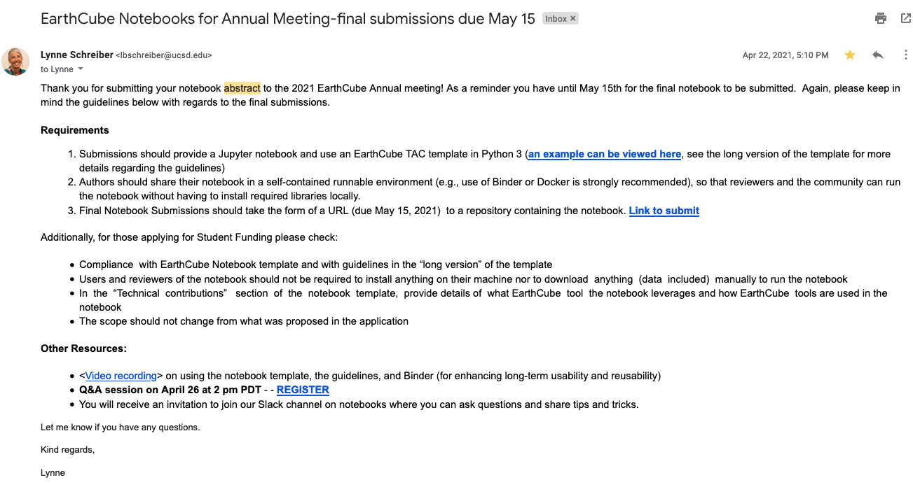

# Earthcube-Meeting-2021
Repository to host notebook/support materials needed for Earthcube 2021 Meeting

# Docker instructions
To build docker image based on `Dockerfile`:
```bash
docker build -t <name> .
```

To run the docker image:
```bash
docker run -dp 8888:8888 <name>
```

## Notes TODO: Delete

Notebook template
https://github.com/earthcube/NotebookTemplates

Requirements


## Todos TODO: Delete

1. Finish API requirements for Notebook

2. Finish Notebook

3. Package and run with docker

4. package with abstract?

5. clean up readme and documentation